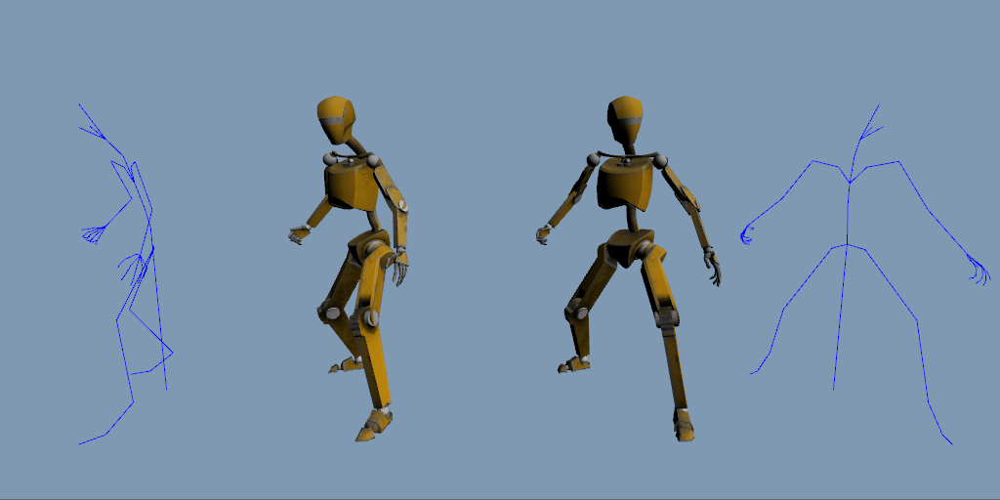

# Hands-On C++ Game Animation Programming

## Changes
* glfw OpenGL context management instead of Win32
* glew OpenGL loader instead of glad
* added glm & gtest (math fixes)
* new character rig and animation
* wip Rokoko ML animation retarget

## References
 * [Hands-On C++ Game Animation Programming](https://github.com/PacktPublishing/Hands-On-Game-Animation-Programming)
 * [robot mesh & rig & animation from KDAB's Qt3D Examples](https://github.com/KDAB/qt3d-examples/tree/master/resources/assets/gltf/2.0/Robot)
 * [YouTube - additional animation sequences from Rokoko Studio's Motion Library](https://youtu.be/REBTKTZUbpQ)
 * [YouTube - retargeting with Rokoko Studio Live Plugin for Blender](https://youtu.be/HitTDDCfhJg&t=140s)
 * [YouTube - converting APose models to a TPose for Rokoko motion capture in Blender](https://youtu.be/PTbxh1J8qLk)
 * [Blender Stack Exchange - combining glTF animations in Blender](https://blender.stackexchange.com/questions/239974/combining-gltf-animations-in-blender-2-93)
